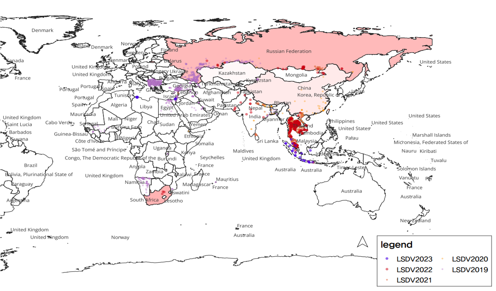
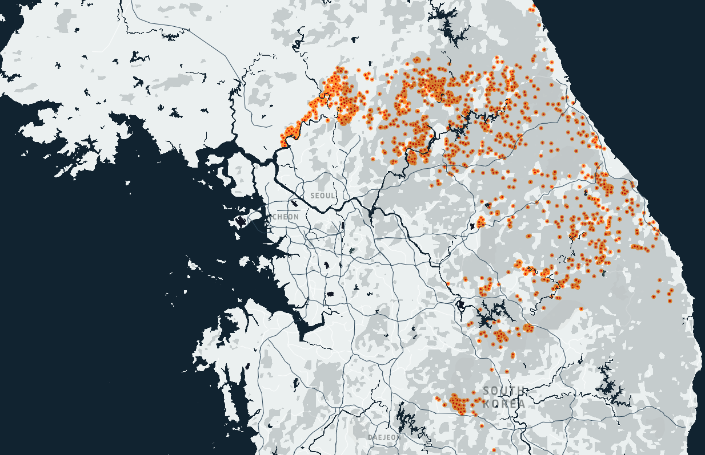

# Lumpy Skin Disease Dashboard

<LSD outbreak situation (2023. 08)>

<ASF outbreak situation(Wild boar, 2023.8)>

This dashboard was created to share information about the recent surge in Lumpy Skin Disease cases in East Asia. 

The application uses React and Express for the front-end and back-end respectively, and NIVO for chart visualizations.

#### How to Run

To start the application, simply run:

```bash
npm start
```
#### Data Sources

- WAHIS: The data visualizations are based on data from the World Animal Health Information System (WAHIS).
- 
- Phylogenetic Tree: The phylogenetic tree is based on recent research from the Pirbright Institute.
Feel free to explore the dashboard and gain insights into the spread and characteristics of Lumpy Skin Disease in East Asia.

Runs the app in the development mode.\
Open [http://localhost:3000](http://localhost:3000) to view it in your browser.

The page will reload when you make changes.\
You may also see any lint errors in the console.